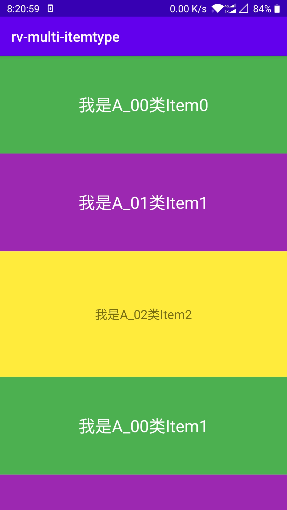
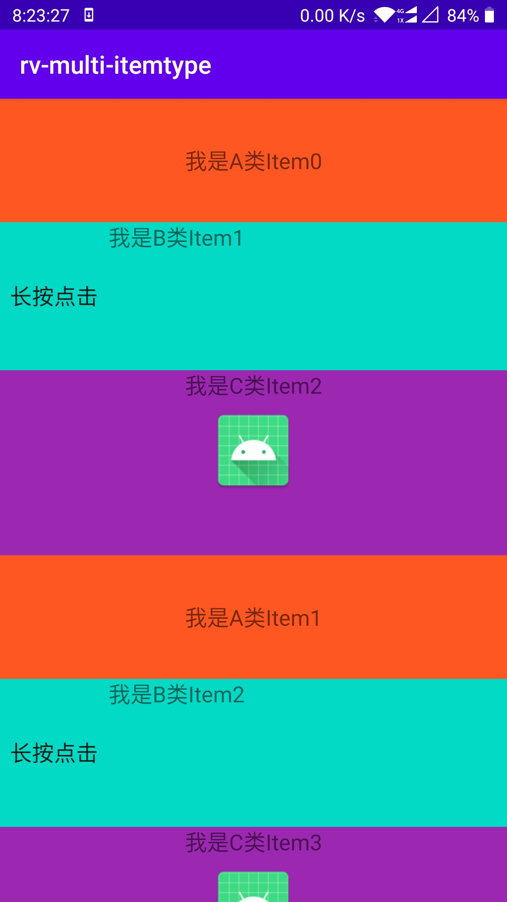

# 介绍

rv-multi-itemtype 是一个轻松优雅实现RecyclerView item
多样式的强大组件。它将RecyclerView
item的样式抽象为一个ItemType，每一种ItemType都自己独立的点击事件处理及视图数据绑定行为，极大地降低了耦合度，极大简化了item相关点击事件处理过程。
正是因为有了上述功能支持，我们在给RecyclerView添加头布局、脚布局以及复杂多样式item布局、RecyclerView嵌套布局的时候，就简单的太多了！

# 核心优势

1. **相比于BaseQuickAdapter及 MultiType库，rv-multi-itemtype
   对RecyclerView 多样式item实现更优雅、更简单！尤其是在“单 bean 类型对应多样 item
   类型”的用法上， 相较于MultiType 的Linker 实现，简单太多了！！**

2. **支持”单 bean 类型对应多样 item 类型“及”多 bean 类型对应多样 item
   类型“用法。**

3. **相比于其他任意RecyclerView辅助组件，rv-multi-itemtype库提供的核心组件
   ItemManager可任意改造其他RecyclerView Adapter，可无缝兼容类似于jetpack
   Paging2、3系列组件提供的Adapter！**

4. **仿系统实现在xml布局文件声明android：onClick="方法名"方式实现了item
   view事件点击**

5. **rv-multi-itemtype 应用泛型+反射+自定义注解技术以减少模板代码创建，轻松实现
   item view（包括 item 子 view）点击事件监听， 大大简化开发者应用。**

6. **支持DiffUtil。**

7. **支持ViewBinding。**


# 依赖

1. **在工程根目录的 build.gradle 文件添加 jitpack 仓库地址：**

```
  allprojects {
      repositories {
        //...
        maven { url 'https://jitpack.io' } 
       }
   }
	
```

2. **在 app module 的 build.gradle文件添加依赖：**

```
   dependencies {
       implementation 'com.gitee.sdecen:rv-multi-itemtype:2.0.3'
   }
```


# 用法

## 一、预前准备

**这里极力推荐 ViewBinding 的用法！**

### 1.1：在 app module build.gradle 文件中开启 ViewBinding 支持：

```
android {
   // ......
   viewBinding {
       enabled true
   }
   // ......
   }
```

### 1.2：在 app module proguard-rules.pro 文件中配置忽略 ViewBinding混淆：

**（不配置会导致无法反射创建ViewBinding对象，程序崩溃！当然，用户要是不嫌麻烦也可以覆盖
SimpleItemType 的 onCreateViewBinding 方法手动创建 ViewBinding对象。）**

```
# 保持 ViewBinding 子类不被混淆。
 -keep class * implements androidx.viewbinding.ViewBinding {
 *;
 }
```

## 二：单 bean 类型对应多样 item类型用法。

### 2.1：声明 item 实体类：

```
public class ItemBean {

    //所有Item类型都在这里定义
    public static final int TYPE_00 = 0;
    public static final int TYPE_01 = 1;
    public static final int TYPE_02 = 2;

    public int id;
    // Item类型标识
    public int viewType;


    //item具体业务数据字段
    public String text = "";


    public ItemBean(int viewType, String text) {
        this.viewType = viewType;
        this.text = text;
    }
    
}
```

### 2.2:编写 00 号类型item 的布局文件 item_00.xml:

```
<?xml version="1.0" encoding="utf-8"?>
<LinearLayout xmlns:android="http://schemas.android.com/apk/res/android"
        xmlns:tools="http://schemas.android.com/tools"
        android:layout_width="match_parent"
        android:layout_height="140dp"
        android:background="#4CAF50"
        android:orientation="vertical">

    <TextView
            android:id="@+id/tv_a"
            android:layout_width="wrap_content"
            android:layout_height="match_parent"
            android:layout_gravity="center"
            android:gravity="center"
            android:textSize="24sp"
        android:textColor="@android:color/white"
            tools:text="A 类 Item" />

</LinearLayout>
```

### 2.3:声明一个00号类型 item 的 ItemType，并继承自SimpleItemType:

```
class ItemType00 : SimpleItemType<ItemBean, Item00Binding>() {

    

    override fun isMatched(bean: Any?, position: Int): Boolean {
        // 如果当前 position 的bean 对象是 ItemBean 类型且 bean.viewType == ItemBean.TYPE_00
        // 则表明当前 position 是与“我”相匹配的，即当前 position 是 00号类型的item样式。
        return bean is ItemBean && bean.viewType == ItemBean.TYPE_00
    }

    // 这里其实就是 onBindViewHolder 方法的演变，只是把ViewHolder 参数
    // 转变成了 ViewBinding 对象，这样使用起来就特别简单了！去除一切自定义
    // ViewHolder及 findViewById 工作！
    override fun onBindView(vb: Item00Binding, bean: ItemBean, position: Int) {
        vb.tvA.text = bean.text
    }

    /**
     *绑定item点击事件
     *
     *（注意：1.这里传入注解的值要与 onViewHolderCreated 方法处
     *     registerClickEvent(...) 方法最后一个参数的值要对应！否则反射不到这个方法。
     *     2. 注意方法形参书写的顺序：View、Bean、position ，写错会导致反射异常！）
     * 
     */
    @BindItemViewClickEvent("onClickItem")
    private fun onClickItem(view: View, itemBean: ItemBean, position: Int) {
        Toast.makeText(view.context, "点击事件：ItemBean:${itemBean.text},position:$position", Toast.LENGTH_SHORT).show()
    }

    /**
     * 绑定item 子View 长点击事件（同理）
     */
    @BindItemViewClickEvent("onLongClickItemChildView")
    private fun onLongClickItemChildView(view: View, itemBean: ItemBean, position: Int): Boolean {
        Toast.makeText(view.context, "长点击事件：ItemBean:${itemBean.text},position:$position", Toast.LENGTH_SHORT).show()
        return true
    }

}
```

说明：SimpleItemType 第一个 泛型参数传的是 bean 类型，第二个泛型参数传的是
该item类型的布局文件的 ViewBinding 类型（由gradle 根据 item_00.xml
文件自动生成）。

·注意看 isMatched(...) 方法的实现，它是区分 item 类型的关键！

### 2.4：同理，编写01号类型的item 布局文件：item_01.xml:(详见工程，略）

### 2.5：同理，声明 01号类型 item对应的 ItemType：

```
class ItemType01 : SimpleItemType<ItemBean, Item01Binding>() {
    
    override fun isMatched(bean: Any?, position: Int): Boolean {
        return bean is ItemBean && bean.viewType == ItemBean.TYPE_01
    }
    
    override fun onBindView(vb: Item01Binding, bean: ItemBean, position: Int) {
        vb.tvA.text = bean.text
    }
    
}
```

这里请再次体会一下 isMatched(...) 方法的含义！！！

同理，再创建一个02号类型 item 的 布局文件 item_02.xml(详见工程源码）

再创建一个 02 号类型 item 对应的 ItemType：

```
class ItemType02 : SimpleItemType<ItemBean, Item02Binding>() {

    override fun isMatched(bean: Any?, position: Int): Boolean {
        return bean is ItemBean && bean.viewType == ItemBean.TYPE_02
    }

    override fun onBindView(vb: Item02Binding, bean: ItemBean, position: Int) {
        vb.tvA.text = bean.text
    }
}
```

请再次再次体会 isMatched(...) 方法的含义！！还不懂？找群主！！

### 2.6：在Activity 中调用：

#### 2.6.1：Activity 布局文件：activity_multi_item.xml

```
<?xml version="1.0" encoding="utf-8"?>
<RelativeLayout xmlns:android="http://schemas.android.com/apk/res/android"
    xmlns:app="http://schemas.android.com/apk/res-auto"
    android:layout_width="match_parent"
    android:layout_height="match_parent">

    <androidx.recyclerview.widget.RecyclerView
            android:id="@+id/rv_list"
            android:layout_width="match_parent"
            android:layout_height="match_parent"
            android:orientation="vertical"
            app:layoutManager="androidx.recyclerview.widget.LinearLayoutManager" />

</RelativeLayout>

```

#### 2.6.2:Activity 中的实现：

```
class MultiItemDemo01Activity : AppCompatActivity() {

    lateinit var adapter: MultiAdapter
    private val vb by lazy { ActivityMultiItemBinding.inflate(LayoutInflater.from(this)) }

    override fun onCreate(savedInstanceState: Bundle?) {
        super.onCreate(savedInstanceState)
        setContentView(vb.root)
        //初始化ItemType
        val item00 = ItemType00()
        val item01 = ItemType01()
        val item02 = ItemType02()
        /*初始化Adapter*/
        adapter = MultiAdapter(this)
        /*将所有ItemType添加到Adapter中*/
        adapter.addItemType(item00)
                .addItemType(item01)
                .addItemType(item02)
        /*设置数据*/
        adapter.setDataList(getData())
        vb.rvList.adapter = adapter
    }
    
    /**
     * 模拟数据
     */
    private fun getData(): List<ItemBean> {
        val beans = ArrayList<ItemBean>()
        for (i in 0..5) {
            beans.add(ItemBean(ItemBean.TYPE_00, "我是A_00类Item$i"))
            beans.add(ItemBean(ItemBean.TYPE_01, "我是A_01类Item${i + 1}"))
            beans.add(ItemBean(ItemBean.TYPE_02, "我是A_02类Item${i + 2}"))
        }
        return beans
    }
    
}

```

点击运行之，如图：



## 四、多 bean 类型对应多样 item 类型用法（顺便介绍了基于 paging3 PagingDataAdapter 改造而来的MultiPagingDataAdapter 用法）

### 4.1 声明item 实体类 BeanA,BeanB,BeanC:

```
public class BeanA {
    
    //item具体业务数据字段
    public int id;
    public String text = "";
    
    public BeanA( String text) {
        this.text = text;
    }
    
}

public class BeanB {

    public String text;

    public BeanB(String text) {
        this.text = text;
    }
}

public class BeanC {
    
    public String text="";
    
    public BeanC( String text) {
        this.text = text;
    }
}
```

### 4.2 声明 A，B，C 类型item对应的布局文件（详见工程源码，略）

### 4.3 声明 A，B，C 类型item对应的 ItemType：

```
public class AItemType extends SimpleItemType<BeanA, ItemABinding> {

 
    @Override
    public boolean isMatched(@Nullable Object bean, int position) {
        // 只有当前 bean 是 BeanA 类型，才能与“我”匹配。
        return bean instanceof BeanA;
    }

    @Override
    public void onBindView(@NonNull ItemABinding binding,
                                 @NotNull BeanA itemBean,
                                 int position) {
        binding.tvA.setText(itemBean.text);
    }
}

public class BItemType extends SimpleItemType<BeanB, ItemBBinding> {

    @Override
    public boolean isMatched(Object bean, int position) {
        // 只有当前 bean 是 BeanB 类型，才能与“我”匹配。
        return bean instanceof BeanB;
    }

    @Override
    public void onBindView(@NonNull ItemBBinding binding, @NonNull BeanB data, int position) {
   
        binding.tvB.setText(data.text)
    }

}

public class CItemType extends SimpleItemType<BeanC, ItemCBinding> {

    @Override
    public boolean isMatched(Object bean, int position) {
        // 只有当前 bean 是 BeanC 类型，才能与“我”匹配。
        return  bean instanceof BeanC;
    }

    @Override
    public void onBindView(@NonNull ItemCBinding binding,
                                 @NonNull BeanC bean, int position) {
        binding.tvC.setText(bean.text);
    }
}

```

### 4.4 在Activity中的实现：

```
class MultiItemDemo02Activity : AppCompatActivity() {

    private lateinit var adapter: MultiPagingDataAdapter
    private val vb by lazy { ActivityMultiItemBinding.inflate(LayoutInflater.from(this)) }

    override fun onCreate(savedInstanceState: Bundle?) {
        super.onCreate(savedInstanceState)
        setContentView(vb.root)
        //初始化ItemType
        val aItemType = AItemType()
        val bItemType = BItemType()
        val cItemType = CItemType()
        /*初始化Adapter*/
        adapter = MultiPagingDataAdapter(this, diffCallback = object : DiffUtil.ItemCallback<Any>() {
            override fun areItemsTheSame(oldItem: Any, newItem: Any): Boolean =false
            override fun areContentsTheSame(oldItem: Any, newItem: Any): Boolean =false

        })
        /*将所有ItemType添加到Adapter中*/
        adapter.addItemType(aItemType)
                .addItemType(bItemType)
                .addItemType(cItemType)
        vb.rvList.adapter = adapter
        /*设置数据*/
        lifecycleScope.launch {
            adapter.submitData(PagingData.from(getData()))
        }

    }

    /**
     * 模拟数据
     */
    private fun getData(): List<Any> {
        val beans = ArrayList<Any>()
        for (i in 0..5) {
            beans.add(BeanA( "我是A类Item$i"))
            beans.add(BeanB("我是B类Item${i + 1}"))
            beans.add(BeanC( "我是C类Item${i + 2}"))
        }
        return beans
    }

}

```

点击运行之，如图：



## 五.item view（包括 item 子 view）点击事件处理。

item view 点击事件处理是模仿了系统在xml 布局文件中声明 android:onClick="方法名"
属性实现方式实现。rv-multi-itemtype 自定义了 "linkClick"和”linkLongClick“
这两个xml 属性，其值含义与系统 android:onClick="方法名"相同，并通过自定义
LayoutInflater.Factory2
实现这两个属性值的捕获，最后通过反射技术获取到对应的目标方法实现点击事件回调。其原理与系统
android:onClick="方法名" 实现方式如出一辙！
以“多bean类型对应多样item类型”实现为例：

**第一步**：在 AItemType 构造方法中调用
SimpleItemtype.bind(clickEventReceiver Any)
方法绑定点击事件接收者（此时可以对比一下系统
android:onClick="方法名"实现，其默认的点击事件接收者是当前xml
布局对应的Activity。），并声明点击事件回调方法，代码如下：

```
public class AItemType extends SimpleItemType<BeanA, ItemABinding> {

    public AItemType() {
        bind(this);// 绑定点击事件接收者。
    }

    @Override
    public boolean isMatched(@Nullable Object bean, int position) {
        return bean instanceof BeanA;
    }


    @Override
    public void onBindView(@NonNull ItemABinding binding,
                           @NotNull BeanA itemBean,
                           int position) {
        binding.tvA.setText(itemBean.text);
    }

    /**
     * item点击事件回调
     * 注意 bean 类型，一定要与当前 ItemType 的 bean 类型对应。
     */
    @Keep
    private void onClickItem(View view, BeanA bean, int position) {
        Toast.makeText(view.getContext(), "点击事件：" + bean.text, Toast.LENGTH_SHORT).show();
    }
}

```

这里要注意点击事件回调方法的书写，返回值为 void ，形参列表顺序及含义分别是：  
点击的那个 View 对象、当前 position 对应的item bean 对象、当前 position。 **（
@Keep 注解是防止代码混淆，否则反射不到回调方法）**

**第二步**：在 AItemType 对应的 item_a.xml 布局中将要注册点击事件的 view 声明
“app:linkClick" 属性，并将点击事件回调的方法名注册进去，代码如下：

```
<LinearLayout xmlns:android="http://schemas.android.com/apk/res/android"
    xmlns:tools="http://schemas.android.com/tools"
    android:layout_width="match_parent"
    android:layout_height="100dp"
    xmlns:app="http://schemas.android.com/apk/res-auto"
    android:background="#FF5722"
    android:orientation="vertical">

    <TextView
        android:id="@+id/tv_a"
        android:layout_width="wrap_content"
        android:layout_height="match_parent"
        android:layout_gravity="center"
        android:gravity="center"
        app:linkClick="onClickItem"
        android:textSize="18sp"
        tools:text="A 类 Item" />

</LinearLayout>
```

再次编译运行APP 就可以看到效果了！

**（item view
长点击事件实现同理，只需要注意的是长点击事件回调方法的书写 必须要有 boolean
返回值！）**

以上就是本框架的主要用法了，有不明白之处找群主，虽忙必复！

# 问题反馈

1 请加群：


